# QuTiP Demo: Quantum State Dynamics Visualizer

[](https://github.com/vishalm/qutip-demo)
[](https://github.com/vishalm/qutip-demo/fork)
[](https://opensource.org/licenses/MIT)
[](https://www.python.org/downloads/)
[](https://qutip.org/)
[](https://www.ibm.com/quantum/qiskit)

This demo project showcases the powerful capabilities of [QuTiP (Quantum Toolbox in Python)](https://qutip.org/) through interactive visualizations and simulations of quantum systems. QuTiP is the world's most popular open-source quantum physics simulation library, used by researchers and educators worldwide.

> 🌟 **[⭐ Star this repo](https://github.com/vishalm/qutip-demo)** if you find it useful! | 🍴 **[Fork it](https://github.com/vishalm/qutip-demo/fork)** to create your own quantum simulations!

## 📁 Project Structure

```
qutip-demo/
├── 📋 README.md                    # Project documentation
├── 📄 LICENSE                      # MIT License
├── 📦 requirements.txt             # Python dependencies
├── 🚫 .gitignore                   # Git ignore rules
├── 📁 demos/                       # 🎪 Core Demonstrations
│   ├── 🌐 bloch_rabi_demo.py       # Bloch sphere & Rabi oscillations (QuTiP)
│   ├── 🌀 decoherence_demo.py      # Quantum decoherence effects (QuTiP)
│   ├── 🔬 cavity_qed_demo.py       # Cavity QED & quantum optics (QuTiP)
│   ├── 🎮 interactive_demo.py      # Interactive real-time controls (QuTiP)
│   └── 🔑 bernstein_vazirani_demo.py # Quantum algorithms (Qiskit)
├── 📁 utils/                       # 🛠️ Utilities & Tools
│   ├── 🚀 run_demos.py             # Demo launcher & menu
│   ├── ✅ verify_installation.py   # Installation verification
│   └── 📸 generate_screenshots.py  # Screenshot helper tool
├── 📁 docs/                        # 📚 Documentation
│   └── 📝 CONTRIBUTING.md          # Contribution guidelines
└── 📁 resources/                   # 🖼️ Visual Resources
    └── 📁 screenshots/             # Demo screenshots
        ├── 🌐 bloch_sphere_rabi.png
        ├── 🚪 quantum_gates_bloch.png
        ├── 🌀 decoherence_comparison.png
        ├── 📉 coherence_loss.png
        ├── 🔬 cavity_qed_rabi.png
        ├── 📊 photon_statistics.png
        ├── 🎮 interactive_demo.png
        ├── 🔑 bernstein_vazirani_qiskit.png
        └── 🚀 demo_launcher.png
```

## 🎯 Demo Overview

This demonstration highlights both **QuTiP** (open quantum systems) and **Qiskit** (quantum computing) through several compelling quantum physics simulations:

1. **Bloch Sphere Visualization & Rabi Oscillations** - Interactive visualization of qubit states and dynamics
2. **Quantum Decoherence Effects** - See how quantum systems lose coherence over time
3. **Cavity QED Dynamics** - Atom-cavity interactions in quantum optics
4. **Interactive Real-time Controls** - Parameter sliders with live visualization updates
5. **Open System Dynamics** - Master equation simulations with environmental effects

## 🌊 Quantum Physics Concepts Flow

```mermaid
flowchart TD
    A["🔬 Quantum System"] --> B["Initial State |ψ₀⟩"]
    B --> C{"System Type?"}
    
    C -->|Closed| D["Schrödinger Equation<br/>iℏ∂|ψ⟩/∂t = H|ψ⟩"]
    C -->|Open| E["Master Equation<br/>dρ/dt = -i[H,ρ] + Lindblad Terms"]
    
    D --> F["Unitary Evolution<br/>|ψ(t)⟩ = U(t)|ψ₀⟩"]
    E --> G["Non-unitary Evolution<br/>ρ(t) with Decoherence"]
    
    F --> H["Pure State Evolution"]
    G --> I["Mixed State Evolution"]
    
    H --> J["Bloch Vector<br/>⟨σₓ,σᵧ,σᵤ⟩"]
    I --> K["Density Matrix<br/>ρ(t)"]
    
    J --> L["🎯 Visualization"]
    K --> L
    
    L --> M["Bloch Sphere"]
    L --> N["Population Dynamics"]
    L --> O["Coherence Loss"]
    L --> P["Energy Exchange"]
    
    style A fill:#e1f5fe
    style D fill:#e8f5e8
    style E fill:#ffebee
    style L fill:#f3e5f5
```



## 🚀 Key Features Demonstrated

### QuTiP Capabilities Showcased:
- **Quantum State Manipulation**: Creating and manipulating quantum states
- **Time Evolution**: Simulating quantum dynamics with various Hamiltonians
- **Visualization Tools**: Beautiful Bloch sphere and state evolution plots
- **Open Systems**: Lindblad master equation for realistic quantum systems
- **Quantum Optics**: Cavity QED and light-matter interactions
- **Educational Tools**: Clear, intuitive demonstrations perfect for learning

### Technical Highlights:
- Real-time interactive plots using matplotlib
- Efficient numerical simulations with NumPy/SciPy backend
- Professional-quality visualizations
- Educational commentary and explanations
- Modular, extensible code structure

## 📋 Prerequisites

- Python 3.8 or higher
- Basic understanding of quantum mechanics (helpful but not required)

## 🛠️ Installation

1. Clone this repository:
```bash
# HTTPS
git clone https://github.com/vishalm/qutip-demo.git
cd qutip-demo

# OR SSH (if you have SSH keys set up)
git clone git@github.com:vishalm/qutip-demo.git
cd qutip-demo
```

2. Install dependencies:
```bash
virtualenv venv
source venv/bin/activate
pip install -r requirements.txt
```

3. Verify installation (recommended):
```bash
python utils/verify_installation.py
```

4. Run the demos:


*Easy-to-use demo launcher with menu selection*

```bash
# Easy demo launcher (recommended)
python utils/run_demos.py

# Or run individual demos directly
python demos/bloch_rabi_demo.py           # QuTiP: Bloch sphere
python demos/decoherence_demo.py          # QuTiP: Decoherence
python demos/cavity_qed_demo.py           # QuTiP: Cavity QED
python demos/interactive_demo.py          # QuTiP: Interactive
python demos/bernstein_vazirani_demo.py   # Qiskit: BV Algorithm
```

## ✅ Recent Updates & Fixes

**Version 2.0 - Enhanced Compatibility & Stability**
- ✅ **Fixed Unicode font issues** - Replaced mathematical symbols with ASCII equivalents for better cross-platform compatibility
- ✅ **Fixed quantum gate operations** - Updated hadamard gate implementation for QuTiP v5.x compatibility  
- ✅ **Enhanced error handling** - Added numerical warning suppression and graceful error recovery
- ✅ **Improved matplotlib compatibility** - Better style fallbacks for different matplotlib versions
- ✅ **Fixed photon statistics plotting** - Resolved array conversion errors in cavity QED demonstrations
- ✅ **Syntax validation** - All demo files validated for Python syntax and structure
- ✅ **Enhanced documentation** - Comprehensive Mermaid diagrams and visual guides
- ✅ **Visual README enhancement** - Added screenshot placeholders and visual gallery structure

## 📸 Adding Screenshots

To complete the visual documentation, add screenshots by running the demos and capturing key moments:

```bash
# Run demos and take screenshots
python demos/bloch_rabi_demo.py        # Capture: Bloch sphere plots
python demos/decoherence_demo.py       # Capture: Decoherence comparisons  
python demos/cavity_qed_demo.py        # Capture: Cavity QED dynamics
python demos/interactive_demo.py       # Capture: Interactive interface
python utils/run_demos.py              # Capture: Demo launcher menu

# Or use the screenshot helper
python utils/generate_screenshots.py
```

Save screenshots as PNG files in `resources/screenshots/` with names matching the README image references.

## 🎮 Demo Execution Flow

```mermaid
sequenceDiagram
    participant User
    participant Launcher as run_demos.py
    participant Demo as Demo Script
    participant QuTiP
    participant MPL as Matplotlib

    User->>Launcher: python run_demos.py
    Launcher->>Launcher: Check Dependencies
    Launcher->>User: Show Menu
    User->>Launcher: Select Demo
    
    alt Bloch Sphere Demo
        Launcher->>Demo: Import bloch_rabi_demo
        Demo->>QuTiP: Create quantum states
        QuTiP->>Demo: |ψ⟩ states
        Demo->>QuTiP: Time evolution H|ψ⟩
        QuTiP->>Demo: |ψ(t)⟩ evolution
        Demo->>MPL: Bloch sphere plot
        MPL->>User: Interactive visualization
    
    else Decoherence Demo
        Launcher->>Demo: Import decoherence_demo
        Demo->>QuTiP: Master equation setup
        QuTiP->>Demo: Open system evolution
        Demo->>MPL: Coherence plots
        MPL->>User: Decoherence visualization
    
    else Cavity QED Demo
        Launcher->>Demo: Import cavity_qed_demo
        Demo->>QuTiP: Jaynes-Cummings model
        QuTiP->>Demo: Atom-cavity dynamics
        Demo->>MPL: Energy exchange plots
        MPL->>User: Quantum optics visualization
    
    else Interactive Demo
        Launcher->>Demo: Import interactive_demo
        Demo->>MPL: Create widgets
        MPL->>User: Show controls
        loop Parameter Updates
            User->>Demo: Adjust sliders
            Demo->>QuTiP: Update simulation
            QuTiP->>Demo: New results
            Demo->>MPL: Update plots
            MPL->>User: Real-time visualization
        end
    end
    
    Demo->>User: Educational explanations
    User->>Launcher: Return to menu
```



## 🎮 Demo Descriptions

### 1. Bloch Sphere & Rabi Oscillations (`bloch_rabi_demo.py`)


*Bloch sphere visualization showing quantum state evolution during Rabi oscillations*

**What it shows**: How a two-level quantum system (qubit) evolves under resonant driving
- Interactive Bloch sphere showing qubit state evolution
- Rabi oscillations between ground and excited states
- Effects of different pulse frequencies and durations
- Real-time animation of quantum state dynamics
- Quantum gate operations and their effects


*Effects of different quantum gates visualized on the Bloch sphere*

**Why it's impressive**: Demonstrates QuTiP's ability to simulate and visualize fundamental quantum phenomena with just a few lines of code.

### 2. Quantum Decoherence (`decoherence_demo.py`)


*Comparison between closed system (blue) and open system (red) evolution showing decoherence*

**What it shows**: How quantum coherence is lost due to environmental interactions
- Pure state evolution vs. mixed state dynamics
- T1 (energy relaxation) and T2 (dephasing) effects
- Lindblad master equation simulation
- Comparison of closed vs. open quantum systems
- Different environmental effects on quantum systems


*T1 and T2 decoherence processes showing different timescales and mechanisms*

**Why it's impressive**: Shows QuTiP's sophisticated treatment of realistic quantum systems with environmental effects.

### 3. Cavity QED Dynamics (`cavity_qed_demo.py`)


*Vacuum Rabi oscillations showing energy exchange between atom and cavity*

**What it shows**: Atom-cavity interactions in quantum optics
- Jaynes-Cummings model simulation
- Vacuum Rabi oscillations
- Photon number dynamics and statistics
- Strong vs weak coupling regime effects
- Cavity decay and thermal state evolution


*Photon number distributions for different quantum states of light*

**Why it's impressive**: Demonstrates QuTiP's applicability to cutting-edge quantum optics research.

### 4. Interactive Demo (`interactive_demo.py`)


*Real-time interactive interface with parameter sliders and live visualization updates*

**What it shows**: Real-time parameter control with live visualization
- Interactive parameter sliders for all demos
- Real-time plot updates as you adjust parameters
- Educational information panels
- Switch between different quantum phenomena
- Perfect for exploration and learning

**Why it's impressive**: Shows how QuTiP integrates seamlessly with modern Python scientific computing tools for interactive exploration.

## 🏗️ Interactive Demo Architecture

```mermaid
graph TB
    A["🎮 Interactive Demo"] --> B["Control Panel"]
    A --> C["Visualization Panel"]
    A --> D["Information Panel"]
    
    B --> E["Parameter Sliders"]
    B --> F["Demo Selection"]
    B --> G["Update Button"]
    
    E --> H["Rabi Frequency Ω"]
    E --> I["Detuning Δ"]
    E --> J["Decoherence γ, γφ"]
    E --> K["Coupling g"]
    E --> L["Time Evolution"]
    
    F --> M["Rabi Oscillations"]
    F --> N["Decoherence"]
    F --> O["Cavity QED"]
    
    C --> P["Main Plot<br/>Population/Energy Dynamics"]
    C --> Q["Bloch Sphere<br/>3D State Visualization"]
    
    D --> R["Physics Explanation"]
    D --> S["Parameter Meanings"]
    D --> T["Real-world Applications"]
    
    H --> U["QuTiP Simulation Engine"]
    I --> U
    J --> U
    K --> U
    L --> U
    
    U --> V["Real-time Results"]
    V --> P
    V --> Q

    style A fill:#e1f5fe
    style B fill:#e8f5e8
    style C fill:#fff3e0
    style D fill:#f3e5f5
    style U fill:#ffebee
```



## 🔬 QuTiP Simulation Workflow

```mermaid
flowchart LR
    A["📥 Input Parameters"] --> B["🔧 System Setup"]
    B --> C["🌊 Quantum State"]
    C --> D["⚡ Hamiltonian"]
    D --> E{"Evolution Type?"}
    
    E -->|Unitary| F["📐 Schrödinger Equation"]
    E -->|Non-unitary| G["🌀 Master Equation"]
    
    F --> H["🎯 mesolve()"]
    G --> H
    
    H --> I["📊 Time Evolution"]
    I --> J["🧮 Observables"]
    J --> K["📈 Visualization"]
    
    K --> L["🌐 Bloch Sphere"]
    K --> M["📊 Population Plots"]
    K --> N["🔗 Coherence Analysis"]
    K --> O["⚡ Energy Dynamics"]
    
    subgraph "QuTiP Core"
        H
        P["🎲 Quantum Objects (Qobj)"]
        Q["🔀 Operators (σx, σy, σz, a†, a)"]
        R["🧠 Numerical Solvers"]
    end
    
    style A fill:#e3f2fd
    style K fill:#f3e5f5
    style H fill:#ffebee
```



## 🖼️ Visual Gallery

The demos generate beautiful, publication-quality visualizations:

<div align="center">

| Bloch Sphere Dynamics | Decoherence Effects | Cavity QED |
|:---:|:---:|:---:|
|  |  |  |
| Quantum state evolution | Open vs closed systems | Atom-photon interactions |

</div>

*All plots generated using QuTiP's built-in visualization tools with matplotlib - screenshots from actual demo runs*

> **Note**: The images above show real output from the QuTiP demos. These visualizations demonstrate the professional-quality plots that QuTiP generates, making complex quantum physics concepts accessible and intuitive.

## 🎓 Educational Value

This demo is perfect for:
- **Students**: Learning quantum mechanics concepts through visualization
- **Educators**: Teaching quantum physics with interactive tools
- **Researchers**: Exploring QuTiP's capabilities for their own work
- **Industry**: Understanding quantum computing and quantum optics fundamentals

## 🔬 Real-World Applications

The techniques demonstrated here are used in:
- **Quantum Computing**: Qubit control and gate operations
- **Quantum Optics**: Laser-atom interactions and cavity QED
- **Quantum Sensing**: Precision measurements with quantum systems
- **Quantum Communication**: Quantum state preparation and manipulation

## 🌟 Why QuTiP?

QuTiP stands out because it:
- **Just Works**: Clean, intuitive API that makes complex quantum physics accessible
- **Production Ready**: Used by major quantum computing companies and research institutions
- **Comprehensive**: Covers everything from basic quantum mechanics to advanced open systems
- **Well Documented**: Extensive tutorials, examples, and community support
- **Free & Open**: No licensing fees, perfect for education and research
- **Battle Tested**: Downloaded over 1 million times and used worldwide

## 🧬 Physics Concepts Relationships

```mermaid
mindmap
  root((QuTiP Physics))
    Quantum States
      Pure States |ψ⟩
        Superposition
        Entanglement
      Mixed States ρ
        Thermal States
        Decoherence
    Evolution
      Unitary
        Schrödinger Equation
        Quantum Gates
      Non-Unitary
        Master Equation
        Lindblad Form
    Systems
      Closed
        Energy Conservation
        Reversible
      Open
        Environment Interaction
        Irreversible
    Visualization
      Bloch Sphere
        State Representation
        Trajectory Tracking
      Population Dynamics
        Time Evolution
        Oscillations
    Applications
      Quantum Computing
        Gate Operations
        Error Correction
      Quantum Optics
        Cavity QED
        Photon Statistics
      Quantum Sensing
        Coherence Control
        Precision Measurements
```



## 📚 Learn More

### 🔗 QuTiP Resources
- [QuTiP Official Website](https://qutip.org/) - Main project homepage
- [QuTiP Documentation](https://qutip.org/docs/latest/) - Complete API reference
- [QuTiP Tutorials](https://qutip.org/tutorials/) - Official tutorials and examples
- [QuTiP GitHub Repository](https://github.com/qutip/qutip) - Main QuTiP source code

### 🎓 Educational Resources
- [Quantum Mechanics Course](https://qutip.org/lectures/) - Online quantum mechanics lectures
- [Quantum Optics Book](https://qutip.org/qutip-tutorials/quantum-optics/) - Quantum optics with QuTiP
- [Research Papers](https://qutip.org/papers/) - Academic papers using QuTiP

### 🤝 Community & Documentation
- [GitHub Discussions](https://github.com/vishalm/qutip-demo/discussions) - Ask questions and share ideas
- [GitHub Issues](https://github.com/vishalm/qutip-demo/issues) - Report bugs and request features
- [QuTiP Google Group](https://groups.google.com/forum/#!forum/qutip) - Official QuTiP community
- [Setup Guide](docs/SETUP.md) - Detailed project structure and setup instructions
- [Contributing Guidelines](docs/CONTRIBUTING.md) - How to contribute to this project

## 🤝 Contributing

We welcome contributions! This demo is designed to be educational and extensible. Here's how you can help:

### 🚀 Quick Start for Contributors
1. **Fork** the repository: [Fork on GitHub](https://github.com/vishalm/qutip-demo/fork)
2. **Clone** your fork: `git clone https://github.com/YOUR_USERNAME/qutip-demo.git`
3. **Create** a branch: `git checkout -b feature/your-feature-name`
4. **Make** your changes and **test** them
5. **Commit**: `git commit -m "Add your feature"`
6. **Push**: `git push origin feature/your-feature-name`
7. **Open** a [Pull Request](https://github.com/vishalm/qutip-demo/pulls)

### 🎯 Contribution Ideas
- **New quantum system demonstrations** (spin chains, many-body systems, etc.)
- **Enhanced visualizations** (3D plots, animations, interactive widgets)
- **Educational content** (tutorials, exercises, explanations)
- **Performance optimizations** (faster simulations, better algorithms)
- **Documentation improvements** (clearer explanations, more examples)
- **Bug fixes** and **stability improvements**

### 📋 Guidelines
- Follow Python PEP 8 style guidelines
- Add docstrings to new functions
- Include tests for new features
- Update README if adding new demos
- Keep educational focus - explain the physics!

### 🐛 Found a Bug?
Please [open an issue](https://github.com/vishalm/qutip-demo/issues) with:
- Description of the problem
- Steps to reproduce
- Expected vs actual behavior
- Your system info (OS, Python version, QuTiP version)

## 📝 License

This project is licensed under the MIT License - see the [LICENSE](LICENSE) file for details.

## 🙏 Acknowledgments

- **[QuTiP Team](https://github.com/qutip/qutip)** - For creating the amazing QuTiP library
- **Scientific Python Community** - NumPy, SciPy, Matplotlib developers
- **Open Source Contributors** - Everyone who makes open science possible

## 📊 Project Stats


---

<div align="center">

**⭐ Don't forget to star this repository if it helped you! ⭐**

[🌟 **Star on GitHub**](https://github.com/vishalm/qutip-demo) • [🍴 **Fork**](https://github.com/vishalm/qutip-demo/fork) • [📝 **Report Bug**](https://github.com/vishalm/qutip-demo/issues) • [💡 **Request Feature**](https://github.com/vishalm/qutip-demo/issues)

*This demo showcases QuTiP v5.x. QuTiP continues to evolve with new features and improvements, making quantum physics simulation more accessible than ever before.*

**Made with ❤️ for the quantum physics community**

</div>